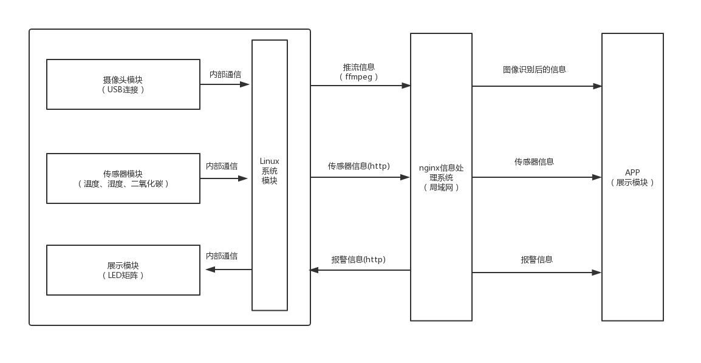
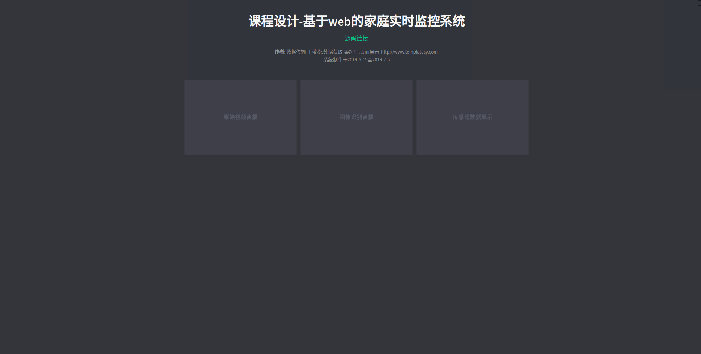

## 基于WEB技术的实时监控系统

### 1. 系统设计架构图

左侧模块是监控目标位置，课程设计中，采用CVT-S5PV210嵌入式教学实验箱  

中间模块是服务器处理模块，使用netty框架和nginx实现数据传输  

右侧模块为展示模块，本项目包括web端展示和APP展示  

**本项目是监控系统的基本模块，在其之上，可以进行二次开发，添加自己的功能;后期也将模块化代码和功能**  

### 2. NETTY框架功能介绍

在本系统中，传感器实时数据展示采用**websocket长连接**，采用原生的netty通信框架开发，避免使用tomcat+spring而带来的限制；在代码设计中，采用设计模式的思想优化原生的netty代码。

在netty中，主要包括监控环境的数据获取、数据库模块、展示模块的数据数据传输（长连接机制保证服务器的数据主动传输）

### 3. nginx 功能介绍

在本系统中，使用nginx的rtmp模块实现直播推流；获取到摄像头的数据，转换为rtmp协议的数据，在wen端和安卓端展示

### 4. WEB端展示模块

### 5. APP 展示模块

